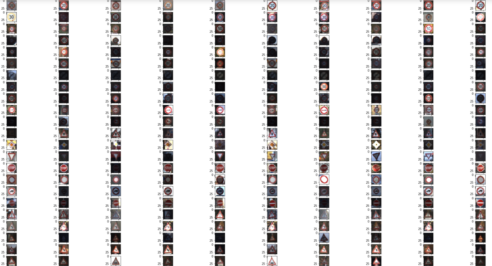

### Data Set Summary & Exploration

#### 1. Summary of the data set

I used the pandas library to calculate summary statistics of the traffic
signs data set:

* The size of training set is 34799
* The size of the validation set is 4410
* The size of test set is 12630
* The shape of a traffic sign image is (32, 32, 3)
* The number of unique classes/labels in the data set is 43

#### 2. Include an exploratory visualization of the dataset.

Here is an exploratory visualization of the data set. It is a bar chart showing how the data ...

### Design and Test a Model Architecture

#### 1. Describe how you preprocessed the image data. What techniques were chosen and why did you choose these techniques? Consider including images showing the output of each preprocessing technique. Pre-processing refers to techniques such as converting to grayscale, normalization, etc. (OPTIONAL: As described in the "Stand Out Suggestions" part of the rubric, if you generated additional data for training, describe why you decided to generate additional data, how you generated the data, and provide example images of the additional data. Then describe the characteristics of the augmented training set like number of images in the set, number of images for each class, etc.)

As a first step, I decided to normalize the data because it reduces deviation and fast convergence,I multiply each data by 1/255 and let the result be between 1~255.

Next step, I used LabelBinarizerI in sklearn to convert the label data to one hot coding because this can be easily marked by the computer.

The difference between the original data set and the augmented data set is the following.
1. original data beturn 1~255, and augmented data beturn 0~1
2. original label data is a number, and augmented data is an one hot coding array.

#### 2. My model architecture.

My final model consisted of the following layers:

| Layer         		|     Description	        					|
|:---------------------:|:---------------------------------------------:|
| Input         		| 32x32x3 RGB image   							|
| Convolution 5x5     	| 1x1 stride, vaild padding, outputs 28x28x32	|
| RELU					|												|
| Max pooling	      	| 2x2 stride,  outputs 14x14x32 				|
| Convolution 5x5     	| 1x1 stride, vaild padding, outputs 10x10x28 	|
| RELU					|												|
| Max pooling	      	| 2x2 stride,  outputs 5x5x28				 	|
| flatten				|	Input = 5x5x28. Output = 700.				|
| Fully connected		| Input = 700. Output = 210	      				|
| RELU					|												|
| Fully connected		|Input = 210. Output = 84       				|
| RELU					|												|
| Fully connected		| Input = 84. Output = 43      					|
| Softmax				|      Input = 43. Output = 43 					|

#### 3. Trained step.

To train the model, I used a EPOCHS size of 10,a BATCH_SIZE of 128,and a rate of 0.001

#### 4. Finding a solution.

My final model results were:
* training set accuracy of 0.935
* validation set accuracy of 4410
* test set accuracy of 10000

The first thr I chosen the architecture of LeNet,and change the input from 32*32*1 to 32*32*3.
But it's only get a accuracy of 0.91,so I change the deep after convolution for layer1.
But the result is still not ideal,I change the deep of layer2 too.
Finally, I got a accuracy of 0.935.

### Test a Model on New Images

#### 1. Difficult.

There might be difficult that The image I download format is ppm. And size is variety.

#### 2. Compare the results to predicting.

Here are the results of the prediction:

| Image			        |     Prediction	        					|
|:---------------------:|:---------------------------------------------:|
| Vehicles over 3.5 metric tons prohibited | Vehicles over 3.5 metric tons prohibited|
| Speed limit (30km/h)     			|Speed limit (30km/h)	|
| Keep right					| Keep right									|
| Turn right ahead	|Road work		|
| Right-of-way at the next intersection		| Right-of-way at the next intersection				|

The model was able to correctly guess 7 of the 10 traffic signs, which gives an accuracy of 70%.It is low to the accuracy on the test set,might be the photos I downloaded have a lot of noise.

#### 3. Probabilities

For the first image, the top five soft max probabilities were

| Probability         	|     Prediction	        					| 
|:---------------------:|:---------------------------------------------:| 
|1.00000000e+00        			| Vehicles over 3.5 metric tons prohibited   									| 
| 7.56285139e-12  				| No passing										|
|  1.58723769e-13				| Speed limit (100km/h)									|
|  4.61091872e-15      			| No passing for vehicles over 3.5 metric tons				 				|
| 4.35280914e-15				    | Speed limit (80km/h)     							|

For the second image, the top five soft max probabilities were

| Probability         	|     Prediction	        					| 
|:---------------------:|:---------------------------------------------:| 
| 9.99998808e-01        			| Speed limit (30km/h) 									| 
| 1.17155105e-06  				|Speed limit (80km/h)	|
|  1.71129805e-17				| Speed limit (70km/h)	|
|   1.86946706e-18      			| End of speed limit (80km/h)	|
| 2.63567213e-22				    | Speed limit (20km/h)		|

For the third image, the top five soft max probabilities were

| Probability         	|     Prediction	        					| 
|:---------------------:|:---------------------------------------------:| 
| 6.98124707e-01       			| Keep right	| 
|3.01862925e-01 				| Speed limit (60km/h)	|
|  9.79626020e-06			| Slippery road	|
|   2.08346182e-06     			| Bumpy road		|
|  3.31409808e-07				    | Bicycles crossing		|

For the fourth image, the top five soft max probabilities were

| Probability         	|     Prediction	        					| 
|:---------------------:|:---------------------------------------------:| 
|8.64134848e-01       			| Road work		| 
| 1.22308172e-01 				| No entry	|
|   1.35568278e-02				| Stop							|
|  1.30643244e-07    			| Bumpy road	|
| 9.68833458e-10				    | Beware of ice/snow		|

For the fifth image, the top five soft max probabilities were

| Probability         	|     Prediction	        					| 
|:---------------------:|:---------------------------------------------:| 
| 9.99999642e-01      			|Right-of-way at the next intersection	| 
| 3.85987732e-07 				| Beware of ice/snow	|
|   6.53256962e-11			| End of no passing by vehicles over 3.5 metric tons	|
| 1.89705092e-11     			| Turn left ahead	|
| 7.38157105e-12				    | Priority road	|

